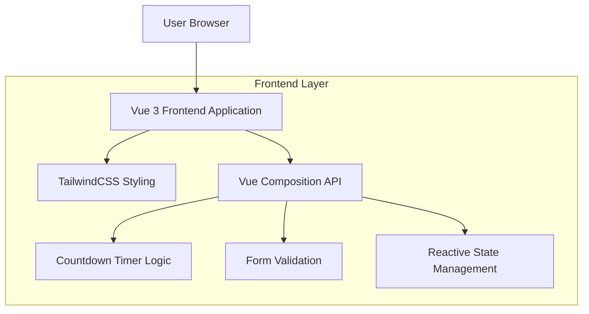

## 1. Architecture Design



## 2. Technology Description
- **Frontend**: Vue 3@latest + TailwindCSS@3.x + Vite
- **Initialization Tool**: vite-init (Vue template)
- **Backend**: None (static landing page with client-side functionality)
- **Build Tool**: Vite for fast development and optimized production builds

## 3. Route Definitions
| Route | Purpose |
|-------|---------|
| / | Landing page with all sections (Hero, About, Roadmap, Join, Launch, Footer) |

Note: Single-page application with smooth scrolling between sections using anchor links.

## 4. Component Architecture

### 4.1 Core Components Structure
```
src/
├── components/
│   ├── HeroSection.vue
│   ├── AboutSection.vue
│   ├── InteractiveRoadmap.vue
│   ├── JoinSection.vue
│   ├── LaunchSection.vue
│   └── FooterSection.vue
├── composables/
│   └── useCountdown.js
├── assets/
│   └── styles/
│       └── main.css
└── App.vue
```

### 4.2 Component Props and Events

**HeroSection.vue**
```typescript
interface HeroProps {
  title: string
  tagline: string
  ctaText: string
}

interface HeroEvents {
  cta-click: () => void
}
```

**LaunchSection.vue**
```typescript
interface LaunchProps {
  launchDate: string // ISO date string
  targetDate: Date
}

interface LaunchEvents {
  signup: (email: string) => void
}
```

**Countdown Composable**
```typescript
interface CountdownState {
  days: number
  hours: number
  minutes: number
  seconds: number
  isExpired: boolean
}

function useCountdown(targetDate: Date): CountdownState
```

## 5. State Management

### 5.1 Reactive State
```typescript
// Global application state
interface AppState {
  userEmail: string | null
  isMenuOpen: boolean
  activeSection: string
}

// Countdown timer state
interface TimerState {
  days: Ref<number>
  hours: Ref<number>
  minutes: Ref<number>
  seconds: Ref<number>
}
```

### 5.2 Form Validation
```typescript
interface EmailValidation {
  isValid: boolean
  errorMessage: string | null
}

function validateEmail(email: string): EmailValidation
```

## 6. Styling Architecture

### 6.1 TailwindCSS Configuration
```javascript
// tailwind.config.js
module.exports = {
  theme: {
    extend: {
      colors: {
        maghreb: {
          green: '#006233',
          red: '#C1272D',
          yellow: '#FFD700',
          blue: '#003153',
          dark: '#1a1a1a',
          light: '#f8f9fa'
        }
      },
      animation: {
        'fade-in': 'fadeIn 0.5s ease-in-out',
        'slide-up': 'slideUp 0.3s ease-out',
        'countdown-tick': 'countdownTick 1s ease-in-out'
      }
    }
  }
}
```

### 6.2 Responsive Breakpoints
- Mobile: `@media (max-width: 768px)`
- Tablet: `@media (max-width: 1024px)`
- Desktop: `@media (min-width: 1025px)`

## 7. Performance Optimization

### 7.1 Build Optimization
- Tree-shaking enabled for unused code elimination
- Code splitting for lazy-loaded components
- CSS purging for production builds
- Image optimization for background illustrations

### 7.2 Runtime Performance
- Vue 3 Composition API for better reactivity performance
- Intersection Observer for scroll-triggered animations
- Debounced scroll events for smooth navigation
- Memoized countdown calculations

## 8. Browser Compatibility
- Modern browsers (Chrome 88+, Firefox 85+, Safari 14+, Edge 88+)
- ES6+ features with Vite's built-in polyfills
- CSS Grid and Flexbox support
- Intersection Observer API for scroll animations

## 9. Deployment Considerations
- Static site generation compatible
- CDN-friendly asset structure
- Environment variables for configuration
- Progressive Web App ready with service worker support