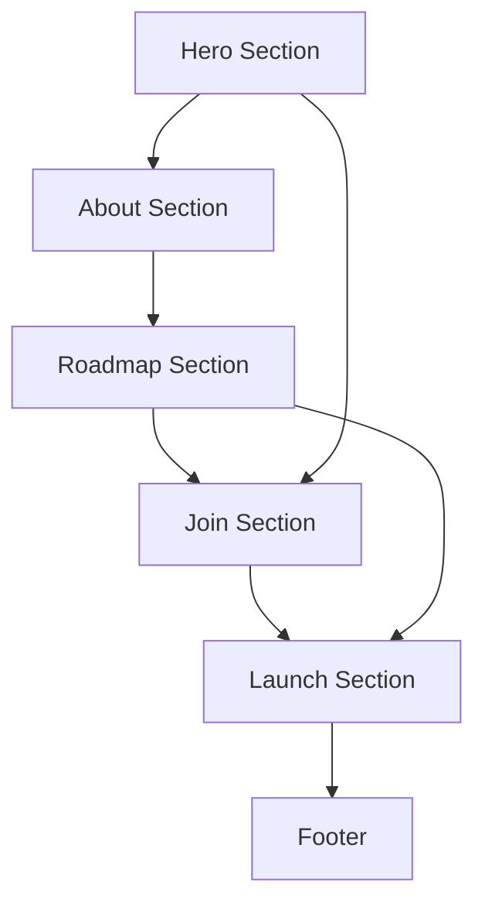

## 1. Product Overview

TheGreatMaghreb is a digital nation platform designed to unite Maghrebi citizens globally through a modern web experience. The platform serves as a virtual homeland that provides digital identity, community connection, and cultural preservation for the Maghrebi diaspora.

The landing page acts as the primary entry point to introduce the digital nation concept, showcase the roadmap, and letting the citizen know the registration starts at the official launch on January 1, 2026.

## 2. Core Features

### 2.1 User Roles

| Role             | Registration Method      | Core Permissions                                                           |
| ---------------- | ------------------------ | -------------------------------------------------------------------------- |
| Visitor          | No registration required | View all landing page content                                              |
| Founding Citizen | Email registration       | Access to exclusive Discord/forum, voting rights, early access to features |

### 2.2 Feature Module

TheGreatMaghreb landing page consists of the following main sections:

1. **Hero Section**: Welcome message, tagline, and primary CTA for founding citizenship
2. **About Section**: Digital nation purpose, vision, and core values with visual icons
3. **Roadmap Section**: Interactive timeline showing 5 development phases with status indicators
4. **Join Section**: Step-by-step process for becoming a founding citizen with benefits highlight
5. **Launch Section**: Countdown timer to official launch date with notification signup
6. **Footer**: Social media links, contact information, and legal notices

### 2.3 Page Details

| Page Name    | Module Name     | Feature description                                                                                                                  |
| ------------ | --------------- | ------------------------------------------------------------------------------------------------------------------------------------ |
| Landing Page | Hero Section    | Display welcoming title, tagline, and prominent "Become a Founding Citizen" CTA button with Maghreb-inspired background illustration |
| Landing Page | About Section   | Present digital nation mission with 3-4 value icons representing unity, digital identity, culture, and empowerment                   |
| Landing Page | Roadmap Section | Show interactive timeline with 5 phases from founding vision to official launch, each with completion status and brief description   |
| Landing Page | Join Section    | Outline 3-step citizenship process: email signup, digital ID receipt, community platform access with benefits enumeration            |
| Landing Page | Launch Section  | Display January 1, 2026 launch date with real-time countdown timer and notification signup form                                      |
| Landing Page | Footer          | Include social media links, contact email, and legal disclaimer stating non-governmental entity status                               |

## 3. Core Process

### Visitor Flow

1. Visitor arrives at landing page and views hero section
2. Explores about section to understand digital nation concept
3. Reviews roadmap timeline to see development progress
4. Clicks "Become a Founding Citizen" CTA
5. Follows 3-step process: email registration → digital ID → community access
6. Optionally signs up for launch notifications

### Founding Citizen Flow

1. Completes email registration through hero or join section CTA
2. Receives digital citizenship ID via email
3. Gains access to exclusive Discord/forum community
4. Receives voting rights and early access to new features
5. Gets notified about official launch and platform updates

## 4. User Interface Design

### 4.1 Design Style

* **Primary Colors**: Maghreb flag-inspired palette (green #006233, red #C1272D, yellow #FFD700, blue #003153)

* **Button Style**: Rounded corners with hover animations and subtle shadows

* **Typography**: Clean sans-serif font hierarchy with clear size distinctions (H1: 3rem, H2: 2.25rem, Body: 1rem)

* **Layout Style**: Card-based sections with generous whitespace and grid/flexbox responsive structure

* **Icon Style**: Minimalist line icons with Maghreb cultural elements

* **Animations**: Smooth transitions (0.3s ease-in-out) for hover effects and section reveals

### 4.2 Page Design Overview

| Page Name    | Module Name     | UI Elements                                                                                                                                           |
| ------------ | --------------- | ----------------------------------------------------------------------------------------------------------------------------------------------------- |
| Landing Page | Hero Section    | Full-width hero with centered content, Maghreb map illustration background, prominent green CTA button with white text, responsive typography scaling |
| Landing Page | About Section   | Three-column grid layout for value icons, each with circular icon container, brief text descriptions, and subtle hover animations                     |
| Landing Page | Roadmap Section | Vertical timeline on mobile, horizontal on desktop, phase cards with status badges (completed/in-progress), progress indicators                       |
| Landing Page | Join Section    | Numbered step cards with icons, benefit highlights in colored badges, prominent CTA button matching hero section styling                              |
| Landing Page | Launch Section  | Large countdown timer display (days:hours:minutes:seconds), email input field with submit button, launch date prominently displayed                   |
| Landing Page | Footer          | Multi-column layout with social media icons, contact information, legal text in smaller font size, consistent color scheme                            |

### 4.3 Responsiveness

* **Desktop-first approach**: Optimized for 1920px+ displays with graceful degradation

* **Mobile breakpoints**: 768px (tablet) and 480px (mobile) with stacked layouts

* **Touch optimization**: Larger tap targets (minimum 44px) and swipe-friendly navigation

* **Flexible grid system**: CSS Grid and Flexbox for adaptive content flow

### 4.4 Technical Animation Requirements

* Vue 3 reactive countdown timer with smooth second transitions

* Intersection Observer for scroll-triggered animations

* CSS transforms for hover effects and micro-interactions

* Optimized for 60fps performance across devices

